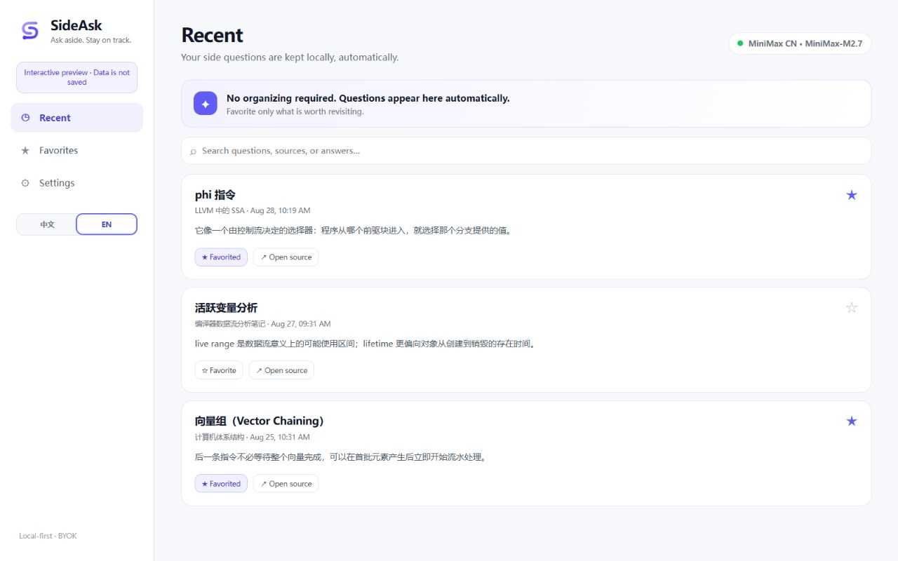

  

  <strong>Ask aside. Stay on track.</strong> 
  A simple, local-first AI side-question layer for the web.

  <a href="README.md">English</a> · <a href="README.zh-CN.md">简体中文</a>

  
  
  
  

  
   SideAsk v0.4 Simple Core · real interactive preview data

## One small question should stay small

You are reading documentation, a paper, GitHub, or a long AI answer. One phrase is unclear. Opening another tab or chat turns a tiny detour into a context switch.

SideAsk keeps the question beside the source:

~~~text
Read → Select → Ask → Follow up → Return
                         └─ Favorite only if useful later
~~~

Select 2–500 characters and choose **✦ Explain**. SideAsk sends only the minimum nearby context needed, streams a safe Markdown answer in a floating panel, and lets you continue without leaving the page.

## Simple Core

- **Ask beside the page** — explain, request an example, ask why it matters, or go deeper.
- **Continue naturally** — follow up in the same small panel and return to the original passage.
- **Recent is automatic** — questions are stored locally with their source and return anchor; no organizing required.
- **Favorites are intentional** — keep only answers worth revisiting.
- **Settings stay out of the way** — Provider, Gateway, language, privacy, and setup live in one place.

The main interface has only three destinations: **Recent**, **Favorites**, and **Settings**. There is no SideAsk account, cloud database, knowledge graph, review queue, or required sync.

## Quick start

Requirements: **Node.js 20+** and Chrome or Edge. The project has no package dependencies.

~~~bash
git clone https://github.com/horry0214/sideask.git
cd sideask
npm start
~~~

When the terminal prints <code>SideAsk Local Gateway running: http://127.0.0.1:8787</code>:

1. Open <code>chrome://extensions/</code> or <code>edge://extensions/</code>.
2. Enable **Developer mode**.
3. Choose **Load unpacked** and select the repository's <code>extension/</code> folder.
4. Follow the first-run guide to review the data disclosure, confirm the Gateway, and add a Provider.
5. Enable optional website access when ready, open the practice page, select **phi node**, and choose **✦ Explain**.

For a dashboard-only demo, run <code>npm run preview</code> and open <code>http://127.0.0.1:8788/preview/</code>. Preview data is isolated and never calls a real Provider.

Store-ready Chrome, Edge, Gateway, listing, privacy, and reviewer materials are documented in the [store submission kit](store/README.md).

## Bring your own model

| Provider | Status | Default endpoint |
| --- | --- | --- |
| MiniMax CN | Supported, including Token Plan keys | <code>https://api.minimaxi.com/v1</code> |
| MiniMax Global | Supported | <code>https://api.minimax.io/v1</code> |
| Custom OpenAI-compatible | Supported | You provide the Base URL |

Provider keys stay in extension-private IndexedDB and are attached by the service worker only when calling the loopback Gateway. They are not exposed to page scripts, logs, or the repository.

See [Provider architecture](docs/PROVIDERS.md) for request normalization, streaming, and the error model.

## Privacy by design

SideAsk sends only:

- text you deliberately select;
- the current readable block and small neighboring snippets;
- recent messages in the active side question;
- a source URL stripped of username, password, query, and hash.

Password fields, forms, editors, <code>contenteditable</code>, explicitly sensitive nodes, scripts, and styles are excluded. The Gateway binds to loopback only. Recent questions, favorites, source anchors, and Provider settings stay local.

Read the full [Privacy Policy](PRIVACY.md) and [Security Policy](SECURITY.md).

## Architecture

~~~text
Web page / ChatGPT
  └─ Selection + minimal context + source anchor
       └─ SideAsk floating panel
            └─ Extension service worker
                 └─ Local Gateway · 127.0.0.1:8787
                      └─ Your configured AI Provider

Extension-private IndexedDB
  └─ providers · recent side questions · favorites · source anchors
~~~

SideAsk uses vanilla JavaScript and CSS with a zero-dependency Node.js Gateway. Existing v0.3 data is preserved when upgrading; the v0.4 interface simply stops asking users to maintain knowledge and weakness states.

## Project status

Current release candidate: **v0.4.0 Simple Core**.

The working release covers selection, streaming Markdown answers, multi-turn follow-ups, return-to-source anchors, automatic recent history, explicit favorites, bilingual UI, Provider management, optional website permission, and first-run setup.

Small improvements can be added later when they reduce friction without adding a new workflow. See the [roadmap](docs/ROADMAP.md).

## Development

~~~bash
npm test
npm run check
~~~

Contributions are welcome. Start with [CONTRIBUTING.md](CONTRIBUTING.md), follow the [Code of Conduct](CODE_OF_CONDUCT.md), and report vulnerabilities through the [Security Policy](SECURITY.md).

## License

[MIT](LICENSE) © 2026 SideAsk contributors.
