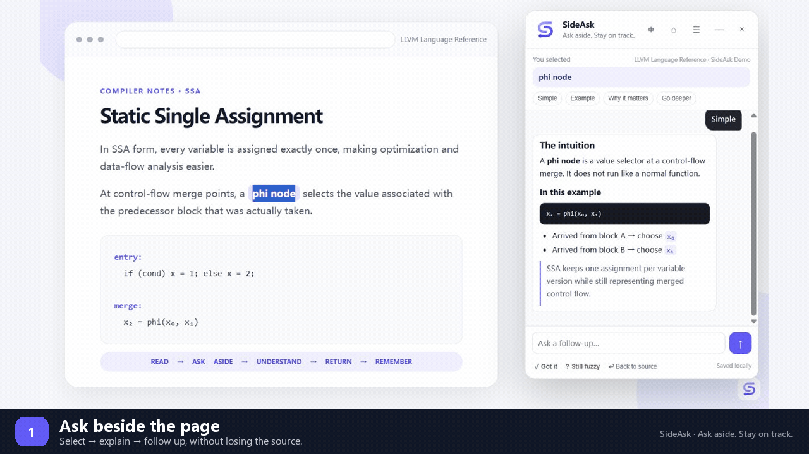
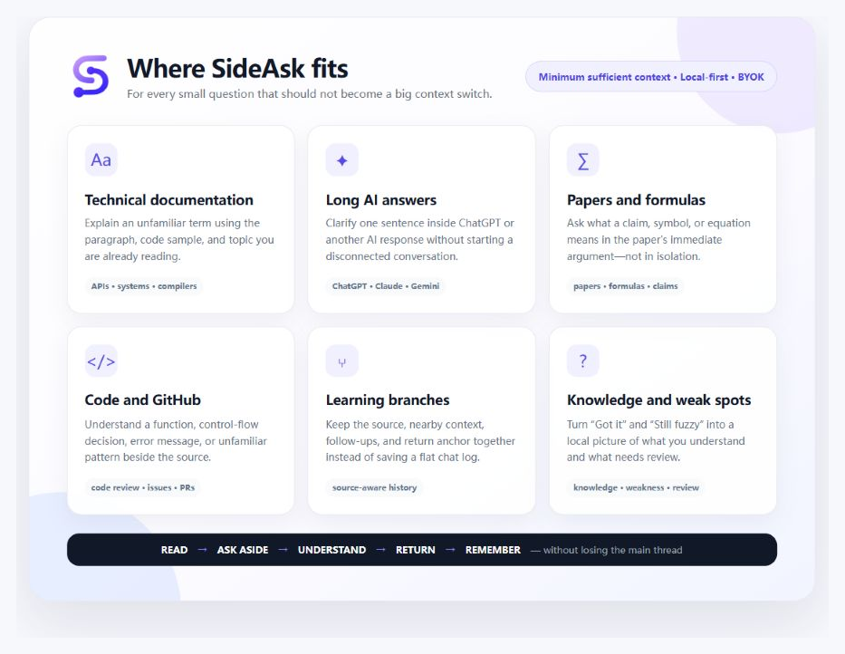
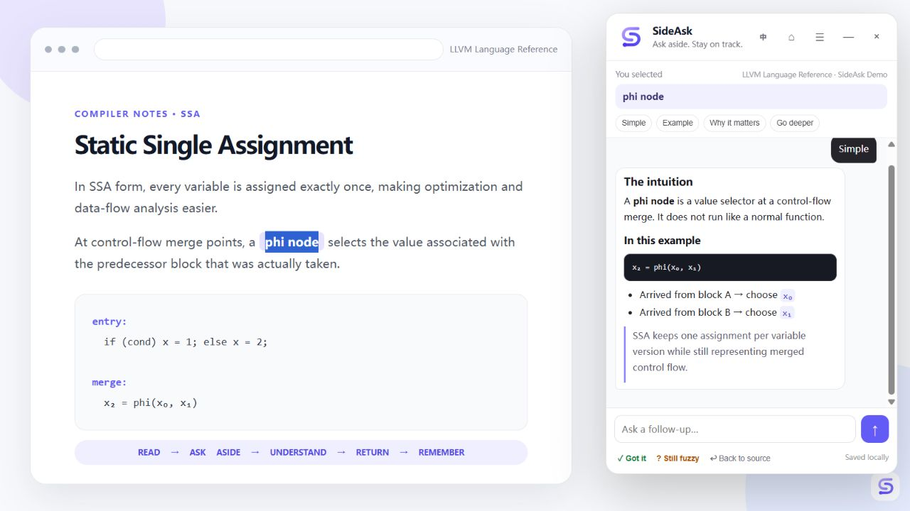
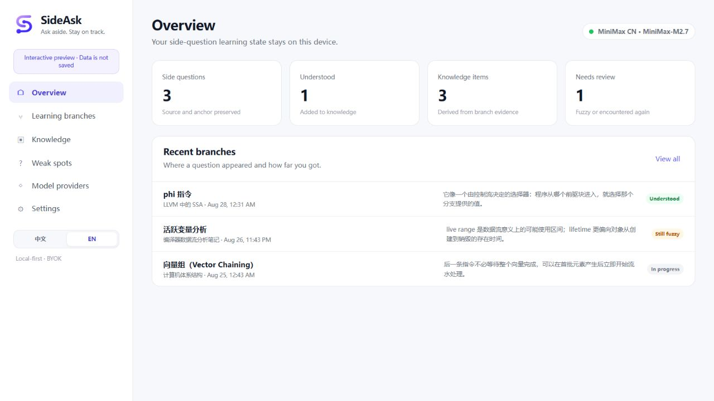
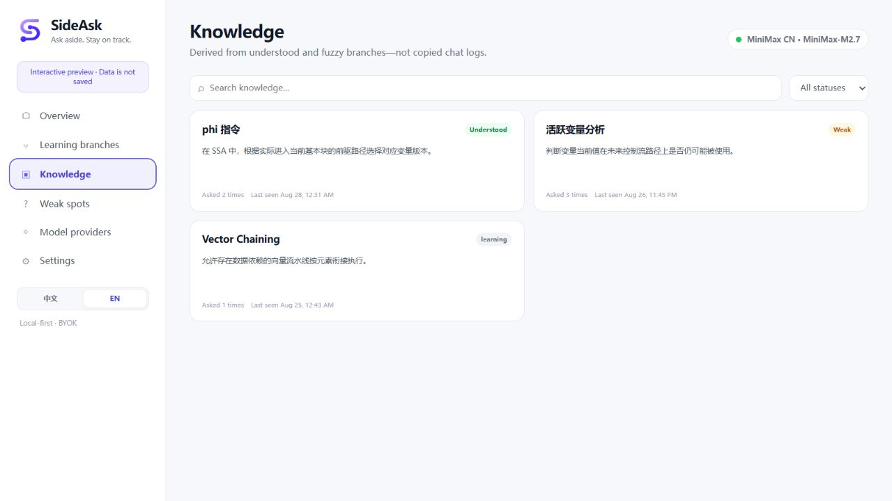
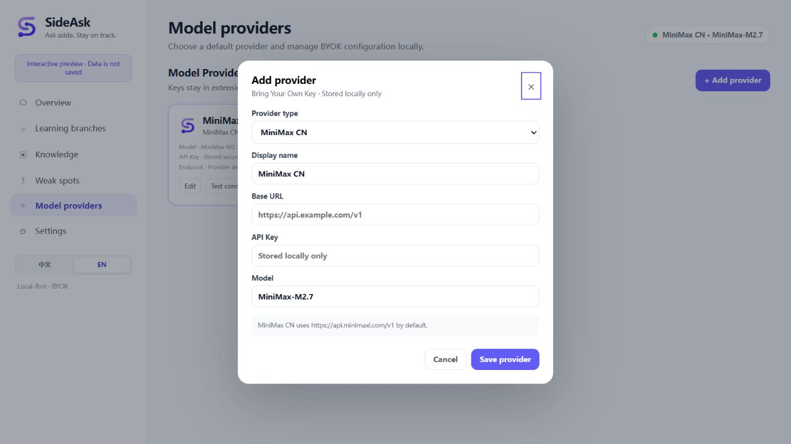
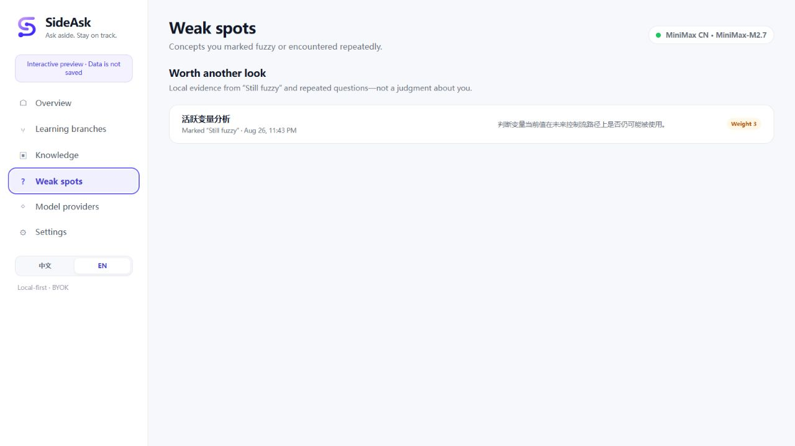

<p align="center">
  
</p>

<p align="center">
  <strong>Ask aside. Stay on track.</strong><br>
  A local-first AI side-question layer for reading, learning, and thinking without losing your place.
</p>

<p align="center">
  <a href="README.md">English</a> · <a href="README.zh-CN.md">简体中文</a>
</p>

<p align="center">
  <a href="LICENSE"></a>
  
  
  
</p>

<p align="center">
  
  <br><sub>A 23-second walkthrough captured from the real MVP interface.</sub>
</p>

## A side question, not a context switch

You are reading documentation, a paper, GitHub, or a long ChatGPT answer. One term blocks you. Opening another tab or chat breaks the flow—and by the time the detour ends, the original thread is gone.

SideAsk keeps the detour beside the page:

```text
Read → Select what is unclear → Ask in SideAsk → Understand → Return → Remember
```

Select 2–500 characters, click **✦ Explain**, and get a context-aware answer in a quiet floating panel. Follow up without leaving the page, mark the concept as understood or fuzzy, then jump back to the source.

## See where SideAsk fits

<p align="center">
  
</p>

Use it when a small question should stay small: decode an unfamiliar API while reading docs, unpack a formula in a paper, inspect a symbol on GitHub, clarify one paragraph in a long AI answer, or preserve a learning detour for later review.

## The MVP, from question to memory

<table>
  <tr>
    <td width="50%"><strong>1 · Ask beside the source</strong><br><sub>Select a phrase, get a safe Markdown answer, and follow up without leaving the page.</sub></td>
    <td width="50%"><strong>2 · Keep the learning trail</strong><br><sub>Every side question retains its source, branch, state, and return anchor.</sub></td>
  </tr>
  <tr>
    <td></td>
    <td></td>
  </tr>
  <tr>
    <td width="50%"><strong>3 · Turn branches into knowledge</strong><br><sub>Browse concepts that are understood and the connections preserved around them.</sub></td>
    <td width="50%"><strong>4 · Bring your own model</strong><br><sub>Configure MiniMax or an OpenAI-compatible endpoint; keys stay in extension-private storage.</sub></td>
  </tr>
  <tr>
    <td></td>
    <td></td>
  </tr>
</table>

<p align="center">
  <strong>Still fuzzy becomes a review signal, not a forgotten chat.</strong><br>
  
</p>

<p><sub>Captured from the current MVP interface. Example answers and learning records use isolated demo data.</sub></p>

## Why SideAsk is different

| Ordinary selection tools | SideAsk |
| --- | --- |
| Explain isolated text | Uses the selected text, nearby readable context, source, and branch history |
| Save flat chat logs | Stores a structured **Learning Branch** with its source anchor |
| Forget the detour | Turns “Got it” and “Still fuzzy” into local knowledge signals |
| Lock you to one vendor | Supports MiniMax and custom OpenAI-compatible providers with BYOK |
| Pull you into another app | Keeps the question beside the content and restores your reading position |

## MVP highlights

- **Context-aware side questions** — selection, nearby paragraphs, source metadata, and recent branch messages.
- **Streaming Markdown answers** — safe headings, lists, tables, links, quotes, inline code, and fenced code blocks.
- **English / 简体中文 UI** — one persistent switch keeps the dashboard and floating panel in sync; answer language follows the selected UI language.
- **Guided first run** — checks the local Gateway and Provider, explains data flow, requests optional website access, and opens a real selection practice page.
- **Multi-turn follow-ups** — continue the branch in the same lightweight panel.
- **Return-to-source anchors** — live DOM range → selector + text → text lookup → scroll fallback.
- **Learning Branches** — preserve where a question came from, not just what was asked.
- **Knowledge and weakness signals** — “Got it” consolidates knowledge; “Still fuzzy” records a review candidate.
- **Provider freedom** — MiniMax CN, MiniMax Global, and any compatible OpenAI-style endpoint.
- **Local-first privacy** — history, provider settings, and learning state stay in extension-private IndexedDB.
- **No build step** — vanilla JavaScript/CSS and a zero-dependency Node.js local gateway.

<details>
<summary><strong>Explore the complete product vision</strong></summary>
<br>

<p><em>The board includes current MVP surfaces and longer-term product direction.</em></p>
</details>

## Quick start

Requirements: **Node.js 20+** and Chrome or Edge. The project has no package dependencies, so there is no install step.

```bash
git clone https://github.com/horry0214/sideask.git
cd sideask
npm start
```

When the terminal prints `SideAsk Local Gateway running: http://127.0.0.1:8787`:

1. Open `chrome://extensions/` or `edge://extensions/`.
2. Enable **Developer mode**.
3. Choose **Load unpacked** and select the repository's `extension/` folder.
4. SideAsk opens its setup guide automatically. Review the data disclosure, confirm the Gateway, and add a default Provider.
5. Choose **Enable on websites** when you are ready; broad HTTP/HTTPS access is optional and can be revoked from the same guide.
6. Open the bundled practice page, select **phi node**, and click **✦ Explain** to complete the real first-use flow.

Store-ready Chrome, Edge, Gateway, images, listing copy, privacy declarations, and reviewer notes are documented in the [store submission kit](store/README.md). Until the public listings are approved, matching ZIP packages are published with each GitHub release.

For a dashboard-only demo, run `npm run preview` and open `http://127.0.0.1:8788/preview/`. Preview data is isolated and does not call a real provider.

## Bring your own model

| Provider | Status | Default endpoint |
| --- | --- | --- |
| MiniMax CN | Supported, including Token Plan keys | `https://api.minimaxi.com/v1` |
| MiniMax Global | Supported | `https://api.minimax.io/v1` |
| Custom OpenAI-compatible | Supported | You provide the Base URL |

Provider keys are stored in extension-private IndexedDB and are attached by the service worker only when calling the loopback gateway. They are not exposed to the page content script, logs, or repository.

See [Provider architecture](docs/PROVIDERS.md) for the registry, request normalization, streaming, and error model.

## Architecture

```text
Web page / ChatGPT
  └─ Selection + minimal context + source anchor
       └─ SideAsk floating panel
            └─ Extension service worker
                 └─ Local Gateway · 127.0.0.1:8787
                      └─ Provider registry + stream/error normalization
                           └─ Your configured AI provider

Extension-private IndexedDB
  └─ providers · sessions · branches · knowledge · weaknesses · reviews
```

SideAsk intentionally stays small today. Working behavior has priority over framework purity; the codebase will only move toward a heavier TypeScript/React structure when scale justifies it.

## Privacy by design

SideAsk sends only the minimum useful context:

- the text you deliberately selected;
- the current readable block and small neighboring snippets;
- recent messages in the active side branch;
- a source URL stripped of username, password, query, and hash.

Password fields, form controls, editors, `contenteditable`, explicitly private nodes, scripts, and styles are excluded. The gateway binds to loopback only and rejects ordinary web-page POST origins.

Read the full [Privacy Policy](PRIVACY.md) and [Security Policy](SECURITY.md).

## Project status

Current release: **v0.3.0 MVP**.

The working MVP covers the selection flow, streaming answers, Markdown rendering, provider management, local Learning Branch storage, basic knowledge consolidation, weakness tracking, history, and anchor restoration.

Next priorities:

1. Harden ChatGPT and PDF/document adapters.
2. Improve cross-page anchor recovery and keyboard shortcuts.
3. Add a small, transparent review loop.
4. Expand providers only when each integration can be tested well.

See the [roadmap](docs/ROADMAP.md) and [architecture](docs/ARCHITECTURE.md).

## Development

```bash
npm test
npm run check
```

`npm run check` validates JavaScript syntax, manifest paths, documentation links, credential leaks, Markdown safety, provider behavior, migrations, and the learning model.

Contributions are welcome. Start with [CONTRIBUTING.md](CONTRIBUTING.md), follow the [Code of Conduct](CODE_OF_CONDUCT.md), and report vulnerabilities through the process in [SECURITY.md](SECURITY.md).

## License

[MIT](LICENSE) © 2026 SideAsk contributors.
