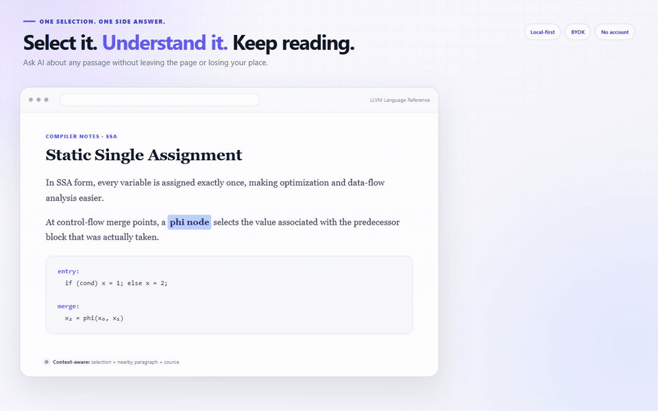

  

  <strong>Select on the web. Ask in place. Stay on track.</strong> 
  A browser-first AI explanation layer, with an optional Windows companion that brings the same flow anywhere.

  <a href="https://github.com/horry0214/sideask/releases/download/v0.7.0/sideask-browser-extension-v0.7.0.zip"><strong>Download the browser extension</strong></a>
  &nbsp;·&nbsp;
  <a href="https://github.com/horry0214/sideask/releases/download/v0.7.0/sideask-desktop-v0.7.0-windows-x64.zip">Get SideAsk Anywhere for Windows</a>

  <a href="README.md">English</a> · <a href="README.zh-CN.md">简体中文</a>

  
  
  
  
  
  

  
   Select → explain with nearby context → follow up → return to the source

## One selection should not become a context switch

You are reading documentation, a paper, GitHub, or a long AI answer. One phrase is unclear. Opening another tab or chat turns a tiny detour into a context switch.

SideAsk keeps the question beside the source:

~~~text
Read → Select → Ask → Follow up → Return
                         └─ Favorite only if useful later
~~~

Select 2–500 characters and choose **✦ Explain**. SideAsk sends only the minimum nearby context needed, streams a safe Markdown answer in a floating panel, and lets you continue without leaving the page.

## Built for the moment you get stuck

| You are looking at… | You select… | SideAsk helps you… |
| --- | --- | --- |
| Technical documentation | an unfamiliar API, compiler term, or system concept | explain it using the nearby paragraph and code sample |
| A paper or formula | a dense claim, symbol, or equation | restate it plainly, define the parts, and show why it matters |
| A long AI answer | one sentence inside ChatGPT, Claude, or Gemini | clarify that sentence without starting another disconnected chat |
| Code or a GitHub page | a function, error, diff, or unfamiliar pattern | understand it beside the source and continue reading the same file |

Choose **Simple**, **Example**, **Why it matters**, or **Go deeper**; then ask a follow-up, favorite the answer if it is useful, or return to the exact source.

## Like it in the browser? Take SideAsk anywhere on Windows

The browser extension remains the primary SideAsk experience. The optional **SideAsk Anywhere for Windows** companion brings the same selection-first flow to places a browser extension cannot reach. Select unfamiliar code, a PDF sentence, terminal output, or text in another Windows app and press `Alt+Shift+A`. Or enable **Show Explain after selecting text** once: mouse-drag or double-click a selection and a small **✦ Explain** button appears beside it. Nothing is sent until you click the button. The option is off by default and can be disabled at any time.

With both clients installed, Desktop enables **Prefer the browser extension on webpages** by default: webpages show the extension button, other Windows apps use Desktop, and duplicate cues are avoided. `Alt+Shift+A` can still force Desktop anywhere.

Desktop reuses the system WebView2 Runtime and shares the loopback Gateway, complete 25-profile catalog, and encrypted Provider Vault with the browser extension. Configure once in either surface and the other immediately uses the same default—without an account or cloud sync. Desktop sends the deliberate selection only; it does not inspect the surrounding contents of another native app.

Codex or another coding agent keeps its task and conversation untouched. See the [Desktop guide](docs/getting-started/DESKTOP.md).

## Simple Core

- **Ask beside the page** — explain, request an example, ask why it matters, or go deeper.
- **Continue naturally** — follow up in the same small panel and return to the original passage.
- **Recent is automatic** — questions are stored locally with their source and return anchor; no organizing required.
- **Favorites are intentional** — keep only answers worth revisiting.
- **Settings stay out of the way** — Provider, Gateway, language, privacy, and setup live in one place.

The main interface has only three destinations: **Recent**, **Favorites**, and **Settings**. There is no SideAsk account, cloud database, knowledge graph, review queue, or required sync.

  
   The management interface stays secondary: Recent, Favorites, and Settings.

## Quick start — browser

Requirements: **Node.js 20+** and Chrome or Edge. The project has no package dependencies.

~~~bash
git clone https://github.com/horry0214/sideask.git
cd sideask
npm start
~~~

When the terminal prints <code>SideAsk Local Gateway running: http://127.0.0.1:8787</code>:

1. Open <code>chrome://extensions/</code> or <code>edge://extensions/</code>.
2. Enable **Developer mode**.
3. Choose **Load unpacked** and select the repository's <code>extension/</code> folder.
4. Follow the first-run guide to review the data disclosure, confirm the Gateway, and add a Provider.
5. Enable optional website access when ready, open the practice page, select **phi node**, and choose **✦ Explain**.

For a dashboard-only demo, run <code>npm run preview</code> and open <code>http://127.0.0.1:8788/preview/</code>. Preview data is isolated and never calls a real Provider.

Store-ready Chrome, Edge, Gateway, listing, privacy, and reviewer materials are documented in the [store submission kit](store/README.md).

## Quick start — SideAsk Anywhere for Windows

Download and extract the complete Windows x64 ZIP, run `SideAsk.exe`, select text in any app, and press `Alt+Shift+A`. To mirror the browser flow, open Settings and enable **Show Explain after selecting text**; a small button then appears after mouse selection. The release folder bundles the Local Gateway and Node.js; current Windows 10/11 installations normally already include the required WebView2 Runtime.

To build it from source on Windows:

~~~powershell
npm run desktop:test
npm run package:desktop
~~~

See the [Desktop installation, privacy, and build guide](docs/getting-started/DESKTOP.md). The Windows package is not code-signed yet, so verify the release checksum if SmartScreen identifies it as an unrecognized app.

## Updating

Store installations update automatically after a reviewed release is published. Git clone and unpacked installations require a pull or file replacement, a Gateway restart, and **Reload** on the browser extensions page. Keep an unpacked extension at the same path whenever possible so its local storage remains attached to the same extension ID.

Follow the complete [English update guide](docs/getting-started/UPDATING.md), or open the [Chinese guide](docs/getting-started/UPDATING.zh-CN.md). To hear only about published versions, choose **Watch → Custom → Releases** on GitHub.

## Bring your own model

SideAsk includes a Hermes-inspired declarative Provider Catalog with 25 presets:

- First-party: OpenAI, Anthropic, Google Gemini, xAI, MiniMax, DeepSeek, Alibaba Qwen, Z.AI / BigModel, and SiliconFlow.
- Routers and inference: OpenRouter, Vercel AI Gateway, Perplexity, Hugging Face, Fireworks AI, Groq, Mistral, Together AI, Cerebras, and NVIDIA NIM.
- Local and custom: Ollama, LM Studio, and any OpenAI-compatible endpoint.

Anthropic uses its native Messages streaming protocol. The other presets share a tested OpenAI-compatible transport where the vendor officially supports it. **Test and fetch models** validates credentials without creating a paid chat completion and fills model suggestions from the Provider's live model catalog.

Provider keys are encrypted once in the Gateway's on-device Vault. Browser and desktop clients receive only redacted metadata and reference the shared default Provider by ID; saved keys are not returned to page scripts, WebViews, logs, or the repository.

See [Provider architecture](docs/reference/PROVIDERS.md) for request normalization, streaming, and the error model.

## Privacy by design

SideAsk sends only:

- text you deliberately select;
- the current readable block and small neighboring snippets;
- recent messages in the active side question;
- a source URL stripped of username, password, query, and hash.

Password fields, forms, editors, <code>contenteditable</code>, explicitly sensitive nodes, scripts, and styles are excluded. The Gateway binds to loopback only. Recent questions, favorites, source anchors, and Provider settings stay local.

The nearby block and source URL apply only to the browser extension. The desktop overlay cannot inspect another native app, so it sends the deliberate selection and active side conversation only.

Read the full [Privacy Policy](docs/policies/PRIVACY.md) and [Security Policy](.github/SECURITY.md).

## Architecture

~~~text
Browser selection ─ Browser floating panel ─┐
                                            ├─ Local Gateway · 127.0.0.1:8787
Desktop selection ─ WebView2 overlay ───────┘             └─ Your AI Provider

Gateway Local Provider Vault
  └─ encrypted Provider credentials shared by browser + desktop

Browser-private IndexedDB
  └─ recent side questions · favorites · source anchors
~~~

SideAsk uses vanilla JavaScript and CSS with a zero-dependency Node.js Gateway. Existing v0.3 data is preserved when upgrading; the v0.4 interface simply stops asking users to maintain knowledge and weakness states.

## Project status

Current stable release: **v0.7.0 Browser First + SideAsk Anywhere**.

The browser extension is the main product. SideAsk Anywhere for Windows is an optional companion for VS Code, PDFs, terminals, and native apps, with a selection-adjacent Explain button, global shortcut activation, a pointer-adjacent overlay, streaming Markdown, tray controls, and the same encrypted Local Provider Vault. The v0.6 VS Code panel was removed because it duplicated the editor UI instead of delivering the lightweight experience SideAsk is built around.

Small improvements can be added later when they reduce friction without adding a new workflow. See the [roadmap](docs/project/ROADMAP.md).

## Development

~~~bash
npm test
npm run check
~~~

Contributions are welcome. Start with the [documentation index](docs/README.md) or [contribution guide](.github/CONTRIBUTING.md), follow the [Code of Conduct](.github/CODE_OF_CONDUCT.md), and report vulnerabilities through the [Security Policy](.github/SECURITY.md).

## License

[MIT](LICENSE) © 2026 SideAsk contributors.
