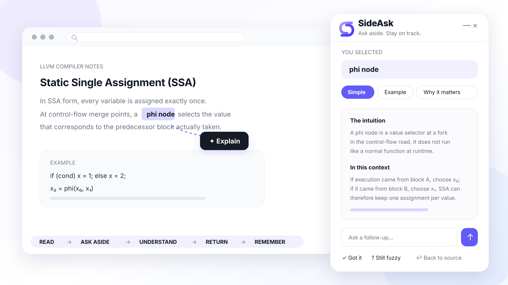
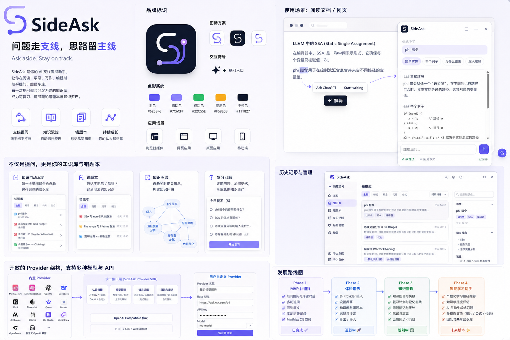

<p align="center">
  
</p>

<p align="center">
  <strong>问题走支线，思路留主线。</strong><br>
  一个用于阅读、学习和思考的 local-first AI 支线提问层。
</p>

<p align="center">
  <a href="README.md">English</a> · <a href="README.zh-CN.md">简体中文</a>
</p>

<p align="center">
  <a href="LICENSE"></a>
  
  
</p>

<p align="center">
  
</p>

## 支线提问，而不是切走上下文

你正在阅读技术文档、论文、GitHub 或 ChatGPT 的长回答，一个术语突然卡住你。传统做法会让你离开页面、打开新对话、重新描述上下文，最后忘记原本读到了哪里。

SideAsk 把这条支线留在原文旁边：

```text
继续阅读 → 选中疑问 → SideAsk 支线 → 理解 → 回到原文 → 本地沉淀
```

选中 2–500 字后点击 **✦ 解释**，SideAsk 会带上附近必要上下文，在安静的悬浮窗里回答。你可以连续追问、标记“我懂了”或“还模糊”，再一键回到原来的阅读位置。

## MVP 能做什么

- **上下文感知解释**：选中文字、当前可读块、前后少量内容、来源和支线消息。
- **流式 Markdown**：安全显示标题、列表、表格、链接、引用和代码块。
- **多轮追问**：不离开当前页面，继续同一条支线。
- **Anchor 恢复**：Live Range → selector + text → text lookup → scroll fallback。
- **Learning Branch**：保存问题来源、上下文、消息、Anchor 与理解状态。
- **知识与薄弱点**：“我懂了”沉淀知识，“还模糊”生成复习候选。
- **开放 Provider**：MiniMax CN、MiniMax Global、Custom OpenAI-compatible。
- **Local-first**：历史、Provider 和学习状态默认保存在扩展私有 IndexedDB。
- **零构建依赖**：原生 JavaScript/CSS 和零依赖 Node.js 本地网关。

<details>
<summary><strong>查看完整产品全景图</strong></summary>
<br>

</details>

## 快速开始

要求 Node.js 20+，项目零依赖，不需要 `npm install`。

```bash
git clone https://github.com/horry0214/sideask.git
cd sideask
npm start
```

看到 `SideAsk Local Gateway running: http://127.0.0.1:8787` 后：

1. 打开 `chrome://extensions/` 或 `edge://extensions/`。
2. 开启“开发者模式”。
3. 点击“加载已解压的扩展程序”，选择仓库的 `extension/` 文件夹。
4. 在 SideAsk 管理页进入“模型服务”，添加、测试并设为默认 Provider。
5. 在普通网页或 ChatGPT 中划词，点击 **✦ 解释**。

只预览管理页时可运行 `npm run preview`，再打开 `http://127.0.0.1:8788/preview/`。预览数据完全隔离，不会调用真实 Provider。

## Provider

| Provider | MVP 状态 | 默认地址 |
| --- | --- | --- |
| MiniMax CN | 支持，兼容 Token Plan Key | `https://api.minimaxi.com/v1` |
| MiniMax Global | 支持 | `https://api.minimax.io/v1` |
| Custom OpenAI-compatible | 支持 | 用户填写 Base URL |

Key 保存在扩展私有 IndexedDB，只由 service worker 附加到 loopback Gateway 请求，不会进入网页 Content Script、日志或仓库。

## 架构

```text
网页 / ChatGPT
  └─ 划词 + 最小上下文 + 来源 Anchor
       └─ SideAsk 悬浮窗
            └─ Extension Service Worker
                 └─ Local Gateway · 127.0.0.1:8787
                      └─ Provider Registry + 流与错误归一化
                           └─ 用户配置的 AI Provider

扩展私有 IndexedDB
  └─ providers · sessions · branches · knowledge · weaknesses · reviews
```

## 隐私边界

SideAsk 默认只发送用户主动选择的文本、当前可读块和少量附近内容、当前支线最近消息，以及已移除 username/password/query/hash 的来源 URL。

密码、表单控件、编辑器、`contenteditable`、显式 private 节点、脚本和样式会被排除。Gateway 只监听 loopback，并拒绝普通网页 Origin 的 POST。

详见 [PRIVACY.md](PRIVACY.md) 和 [SECURITY.md](SECURITY.md)。

## 当前状态

当前版本：**v0.2.5 MVP**。

下一阶段将重点增强 ChatGPT/PDF Adapter、跨页面 Anchor、快捷键和最小复习闭环。完整规划见 [路线图](docs/ROADMAP.md)。

## 开发与贡献

```bash
npm test
npm run check
```

欢迎通过 [贡献指南](CONTRIBUTING.md) 参与。提交问题时请遵守 [行为准则](CODE_OF_CONDUCT.md)，安全问题请按 [安全策略](SECURITY.md) 私下报告。

## License

[MIT](LICENSE) © 2026 SideAsk contributors.
