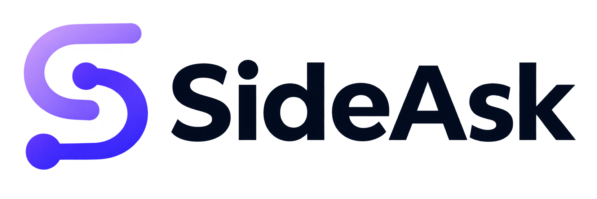
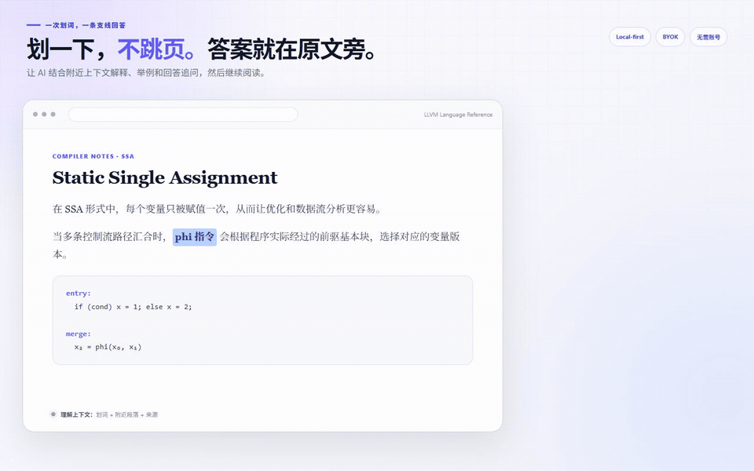
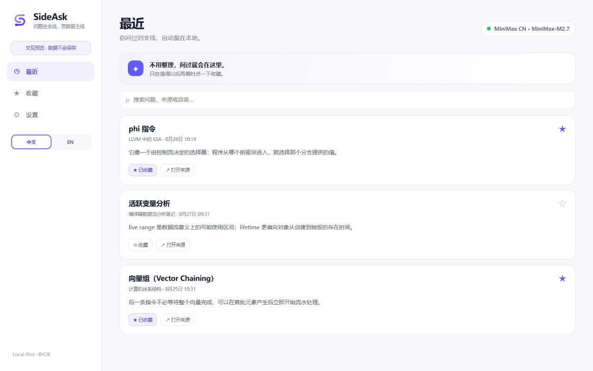

  

  <strong>网页划词，原地提问，主线不断。</strong> 
  一个以浏览器扩展为主的 AI 解释层，并可通过轻量 Windows Companion 把同样体验带到任何地方。

  <a href="https://github.com/horry0214/sideask/releases/download/v0.7.0/sideask-browser-extension-v0.7.0.zip"><strong>下载浏览器扩展</strong></a>
  &nbsp;·&nbsp;
  <a href="https://github.com/horry0214/sideask/releases/download/v0.7.0/sideask-desktop-v0.7.0-windows-x64.zip">下载 SideAsk Anywhere for Windows</a>

  <a href="README.md">English</a> · <a href="README.zh-CN.md">简体中文</a>

  
  
  
  
  

  
   划词 → 结合附近上下文解释 → 继续追问 → 回到原文

## 一次划词，不应该变成一次上下文切换

你正在阅读技术文档、论文、GitHub 或 AI 的长回答，一个短语突然卡住你。打开新标签页或新对话，会把一条很小的支线变成上下文切换。

SideAsk 把问题留在原文旁边：

~~~text
继续阅读 → 选中文字 → 提问 → 追问 → 回到原文
                              └─ 值得以后再看时才收藏
~~~

选中 2–500 字并点击 **✦ 解释**。SideAsk 只携带必要的附近上下文，在悬浮窗中流式显示安全 Markdown 回答，让你不离开当前页面也能继续追问。

## 就在这些卡住你的瞬间

| 你正在看 | 你选中了 | SideAsk 帮你 |
| --- | --- | --- |
| 技术文档 | 陌生 API、编译器术语或系统概念 | 结合附近段落和代码例子解释它 |
| 论文或公式 | 难懂的论断、符号或方程 | 换成直白表达，拆解各部分并说明为什么重要 |
| AI 的长回答 | ChatGPT、Claude 或 Gemini 回答中的一句话 | 不新开对话，直接澄清当前这句话 |
| 代码或 GitHub 页面 | 函数、报错、Diff 或陌生写法 | 在源码旁理解它，然后继续阅读同一文件 |

你可以选择**简单解释、举个例子、为什么重要、深入理解**，随后继续追问；真正有用时收藏，弄懂后回到原文。

## 喜欢网页端？把 SideAsk 带到 Windows 的任何地方

浏览器扩展始终是 SideAsk 的主体验。可选的 **SideAsk Anywhere for Windows** Companion 把同样的划词优先流程带到浏览器插件够不到的地方。选中陌生代码、PDF 句子、终端输出或任意 Windows 应用中的文字，按 `Alt+Shift+A`；也可以在设置中开启一次**划词后显示解释按钮**，之后鼠标拖选或双击选词，选区旁就会出现一个小小的 **✦ 解释**。只有点击按钮后才会发送。该选项默认关闭，也可以随时关闭。

桌面端复用系统 WebView2，与浏览器插件共用 loopback Gateway、25 个 Provider Catalog 和本机加密 Vault。在任一入口配置一次，另一端立即使用同一个默认 Provider；不需要账户或云同步。桌面端只携带主动选区，不会检查另一个原生应用的周围内容。

Codex 或其他编程 Agent 的任务与对话保持不变。详见[桌面悬浮窗指南](docs/DESKTOP.zh-CN.md)。

## Simple Core

- **在原文旁提问**：简单解释、举个例子、为什么重要或深入理解。
- **自然继续追问**：问题始终留在小浮窗里，结束后回到原来的段落。
- **最近记录自动保存**：来源和返回 Anchor 一起留在本地，不要求整理。
- **收藏由用户决定**：只有真正值得以后再看的回答才进入收藏。
- **设置不打扰主流程**：Provider、Gateway、语言、隐私和首次引导集中在一起。

主界面只有三个入口：**最近、收藏、设置**。SideAsk 不要求账户，不依赖云数据库，也不会让用户维护知识图谱、薄弱点或复习队列。

  
   管理界面退居次要位置：最近、收藏和设置。

## 快速开始 — 浏览器

要求 **Node.js 20+** 与 Chrome 或 Edge。项目零依赖，不需要 <code>npm install</code>。

~~~bash
git clone https://github.com/horry0214/sideask.git
cd sideask
npm start
~~~

看到 <code>SideAsk Local Gateway running: http://127.0.0.1:8787</code> 后：

1. 打开 <code>chrome://extensions/</code> 或 <code>edge://extensions/</code>。
2. 开启“开发者模式”。
3. 点击“加载已解压的扩展程序”，选择仓库的 <code>extension/</code> 文件夹。
4. 按首次引导阅读数据说明、确认 Gateway，并添加 Provider。
5. 准备好后开启可选网页访问权，进入练习页，选中 **phi node** 并点击 **✦ 解释**。

只预览管理页时可运行 <code>npm run preview</code>，再打开 <code>http://127.0.0.1:8788/preview/</code>。预览数据完全隔离，不会调用真实 Provider。

Chrome、Edge、Gateway、商店文案、隐私声明与审核说明都整理在[商店提交包](store/README.md)中。

## 快速开始 — SideAsk Anywhere for Windows

下载 Windows x64 ZIP 并完整解压，运行 `SideAsk.exe`，在任意应用选中文字后按 `Alt+Shift+A`。如果希望复用网页端的交互，可在设置中开启**划词后显示解释按钮**，鼠标选词后会先出现一个小按钮。发布目录已经携带 Local Gateway 与 Node.js；当前 Windows 10/11 通常已自带所需的 WebView2 Runtime。

在 Windows 从源码构建：

~~~powershell
npm run desktop:test
npm run package:desktop
~~~

安装、隐私边界与构建说明见[桌面悬浮窗中文指南](docs/DESKTOP.zh-CN.md)。Windows 包尚未做代码签名；若 SmartScreen 提示无法识别，应先核对 Release 校验值。

## 更新

商店安装会在新版审核发布后自动更新；Git Clone 与“加载已解压扩展”的用户需要拉取或覆盖文件、重启 Gateway，并在浏览器扩展管理页点击“重新加载”。应尽量保持开发版扩展的原路径，以便继续使用同一个扩展 ID 对应的本地数据。

请阅读完整的[中文更新指南](UPDATING.zh-CN.md)，也可以切换到[英文版](UPDATING.md)。只想接收正式版本通知时，可在 GitHub 选择 **Watch → Custom → Releases**。

## 使用自己的模型

SideAsk 按照 Hermes 的思路加入声明式 Provider Catalog，共 25 个预设：

- 官方服务：OpenAI、Anthropic、Google Gemini、xAI、MiniMax、DeepSeek、阿里 Qwen、Z.AI / 智谱和 SiliconFlow。
- 路由与推理：OpenRouter、Vercel AI Gateway、Perplexity、Hugging Face、Fireworks AI、Groq、Mistral、Together AI、Cerebras 和 NVIDIA NIM。
- 本地与自定义：Ollama、LM Studio，以及任意 OpenAI-compatible 地址。

Anthropic 使用原生 Messages 流协议；其他预设在供应商官方支持时共用经过测试的 OpenAI-compatible 传输。“检测连接并获取模型”不会发起付费对话，并可从 Provider 的实时模型目录补充建议。

Key 只在 Gateway 的本机 Vault 加密保存一次。浏览器与桌面端只能取得脱敏元数据，并通过 ID 使用共享默认 Provider；已保存 Key 不会返回网页脚本、WebView、日志或仓库。

## 隐私边界

SideAsk 只发送：

- 用户主动选择的文字；
- 当前可读块和少量附近内容；
- 当前支线最近消息；
- 已移除 username、password、query 和 hash 的来源 URL。

密码、表单、编辑器、<code>contenteditable</code>、显式敏感节点、脚本和样式都会被排除。Gateway 只监听 loopback；最近提问、收藏、来源 Anchor 和 Provider 配置保存在本地。

“附近可读块”和来源 URL 只适用于浏览器插件。桌面悬浮窗无法检查另一个原生应用，因此只发送主动选区和当前支线消息。

详见[隐私说明](PRIVACY.zh-CN.md)与[安全策略](SECURITY.zh-CN.md)。

## 架构

~~~text
浏览器划词 ─ 浏览器悬浮窗 ─┐
                            ├─ Local Gateway · 127.0.0.1:8787
桌面划词 ─ WebView2 悬浮窗 ┘             └─ 用户的 AI Provider

Gateway 本机 Provider Vault
  └─ 浏览器与桌面端共用的加密 Provider 凭据

浏览器私有 IndexedDB
  └─ 最近支线 · 收藏 · 来源 Anchor
~~~

SideAsk 使用原生 JavaScript/CSS 与零依赖 Node.js Gateway。升级时不会删除 v0.3 的已有数据；v0.4 只是让用户不再维护知识与薄弱状态。

## 当前状态

当前稳定版：**v0.7.0 Browser First + SideAsk Anywhere**。

浏览器扩展是主产品；SideAsk Anywhere for Windows 是面向 VS Code、PDF、终端和原生应用的可选 Companion，提供选区旁解释按钮、全局快捷键、指针附近悬浮窗、流式 Markdown、系统托盘，以及同一个本机加密 Provider Vault。v0.6 的 VS Code 面板会新开一栏、与编辑器自带对话重复，已经从项目中移除。

后续只加入能够降低摩擦、且不会创造新工作流的小功能。完整规划见[路线图](docs/ROADMAP.md)。

## 开发与贡献

~~~bash
npm test
npm run check
~~~

欢迎通过[贡献指南](CONTRIBUTING.zh-CN.md)参与。提交问题时请遵守[行为准则](CODE_OF_CONDUCT.zh-CN.md)，安全问题请按[安全策略](SECURITY.zh-CN.md)私下报告。

## License

[MIT](LICENSE) © 2026 SideAsk contributors.
